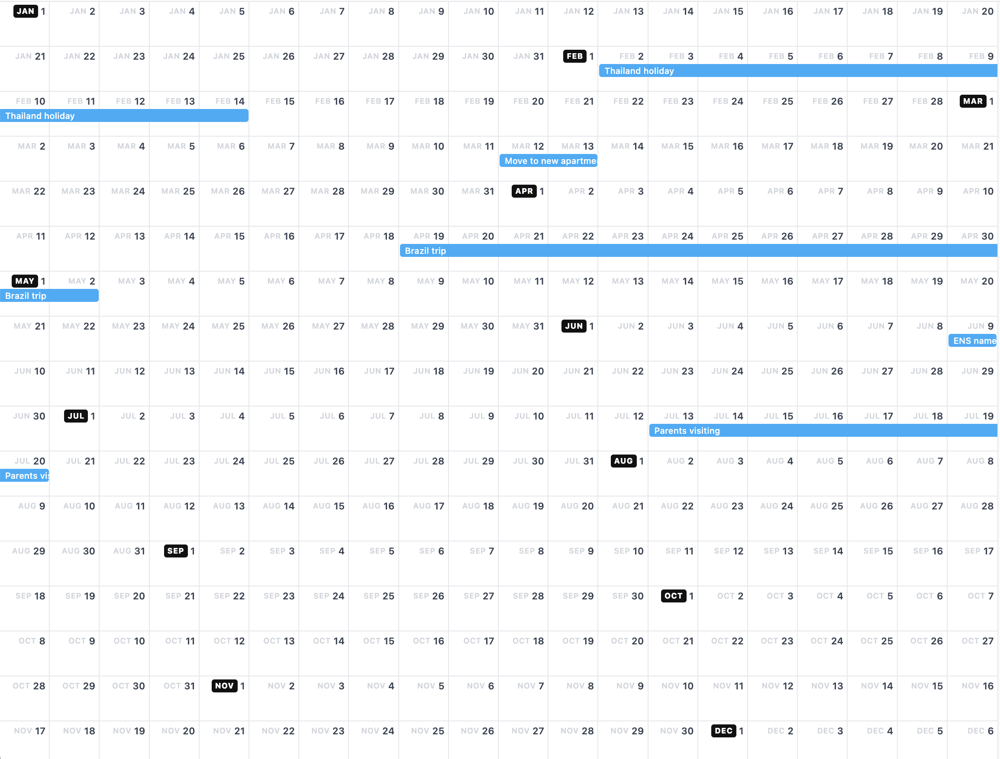

# bigcal
Generates a single-page HTML year view of your macOS Calendar all-day events.



## Usage

```sh
uv run bigcal.py                          # current year
uv run bigcal.py 2025                     # specific year
uv run bigcal.py --list                   # print available calendar names
uv run bigcal.py --calendars "Personal"   # filter to specific calendars
uv run bigcal.py 2025 --calendars "Work,Personal"
open cal.html
```

## Requirements

- macOS (uses EventKit via PyObjC)
- [uv](https://github.com/astral-sh/uv) — handles dependencies automatically via PEP 723 inline metadata

On first run, macOS will prompt for Full Calendar Access in System Settings → Privacy & Security → Calendars.
